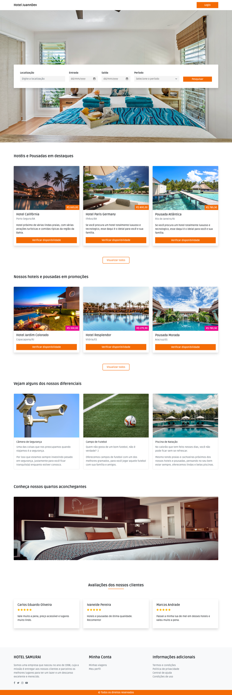
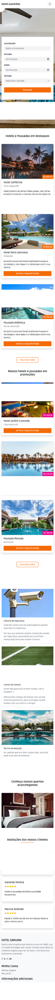

# 🏨 Hotel JuannDev - Sistema de Reserva de Hotéis


Uma landing page moderna e totalmente responsiva para reserva de hotéis e pousadas. O foco deste projeto foi a criação de uma interface limpa (Clean UI) utilizando **Bootstrap 5** para agilidade no layout e **JavaScript Vanilla** para manipulação de componentes e máscaras de input.

---

## 📸 Demonstração

| Desktop Preview | Mobile Preview |
| :---: | :---: |
|  |  |


---

## ✨ Funcionalidades

* **Busca Personalizada:** Filtros de localização, data de entrada/saída e número de hóspedes.
* **Seções em Destaque:** Exibição de hotéis e pousadas com cards estilizados e badges de desconto.
* **Diferenciais:** Seção dedicada a apresentar as vantagens e serviços oferecidos.
* **Avaliações de Clientes:** Slider/Cards com depoimentos para prova social.
* **Design Responsivo:** Interface adaptada para todos os tamanhos de tela (Mobile-First).
* **Estrutura Modular:** CSS organizado por componentes (navbar, buttons, cards, etc.) para facilitar a manutenção.

---

## 🛠️ Tecnologias Utilizadas

* **HTML5:** Estruturação semântica da página.
* **CSS3:** Estilização customizada com foco em variáveis e modularização.
* **Bootstrap 5:** Framework para sistema de grid e componentes responsivos.
* **JavaScript (Vanilla):** Lógica de busca e integração de bibliotecas de máscara.
* **Google Fonts:** Tipografia moderna e ícones de material design.

---

## 🚀 Como Visualizar o Projeto

Como este projeto foi desenvolvido com tecnologias nativas da web, não é necessário instalar dependências.

1. **Clonar o repositório:**
   ```bash
   git clone [https://github.com/juanndev/Reserva-de-Hoteis.git](https://github.com/juanndev/Reserva-de-Hoteis.git)
   ```

2. **Abrir o projeto:**
    ```bash
    Basta abrir o arquivo index.html diretamente no seu navegador.
    Dica: Se estiver usando o VS Code ou Cursor, recomendo usar a extensão Live Server para visualizar as alterações em tempo real.
    ```

## 👤 Autor

### Juan Mota
```bash
Instagram: https://www.instagram.com/juann.dev/
LinkedIn: https://www.linkedin.com/in/juanndev/
GitHub: https://github.com/juanndev
```